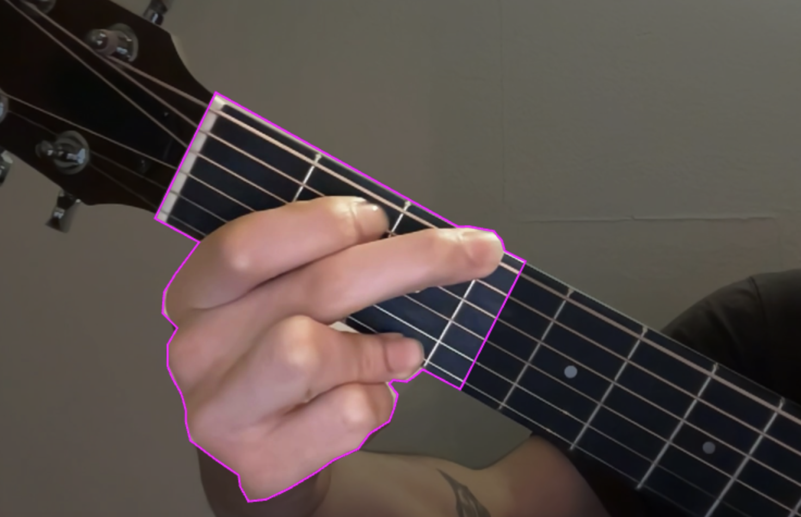
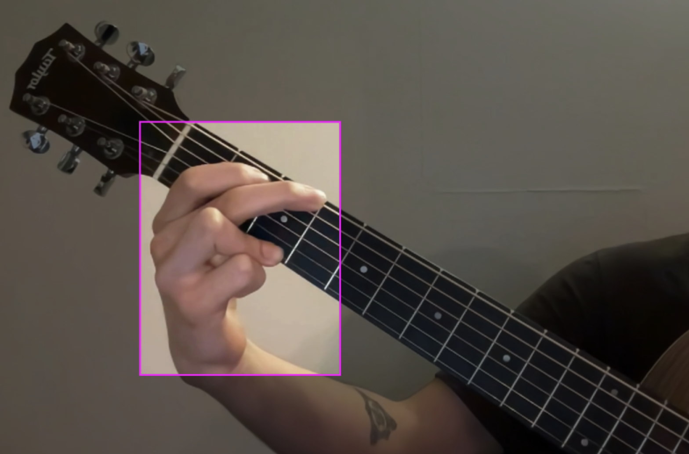

# Code of the application

  
Table of Contents

  <ol>
    <li><a href="#Introduction">Introduction</a></li>
    <li><a href="#get-the-data">Get the data</a></li>
    <li><a href="#annotate-the-data">Annotate the data</a></li>
    <li><a href="#trying-multiple-yolo-models">Trying multiple YOLO models</a></li>
    <li><a href="#Conclusion">Conclusion</a></li>
  </ol>

## Introduction
In this part I will explain how the process of training was done and the decisions that I made during the development of the model. I will explain how I gathered the data and I annotated it.
I will also explain the reasons why I chose to use YOLOv8 and the reasons why I chose to use Roboflow to annotate the data.

(<a href="#readme-top">back to top</a>)

## Get the data
The data was taken from multiple videos in which I played the chords with various lighting conditions using a lamp and also two guitars to have a better variety of images. The videos were then converted into images using a python [script](miscellaneous/GetImages.py) that I made. This script uses the openCV library to extract each 10 frames from the video and saves them in a folder.
As there were too many images I used another script to delete random images from the dataset to have a more balanced dataset. This script can be found [here](miscellaneous/DeleteRandomImages.py).
After having all done, I uploaded the images to Roboflow to annotate them.

(<a href="#readme-top">back to top</a>)

## Annotate the data
I used Roboflow to annotate the data. At the begining I did a model with the annotations trying to give a instance segmentation approach and annotating just 70 images per class. This was not very good, because though the model performed okay, it was not very good. So I decided to increase the amount of images per class to 100 and use object detection instead. This was surprisingly better, so I stuck with this approach, and after trying multiple models I decided to use YOLOv8x and also a version with a smaller model, YOLOv8l. Since it was not much difference between the two models. 
I am sure that if I had more images per class, the model would have performed better, but I did not have the time to do so.
The first annotations, using the segmentation approach looked like this:

The second annotations, using the detection approach looked like this:

### Augmentation
I also used Roboflow to augment the data, and I used the following augmentations:
* Outputs per training example: 3
* Flip: Horizontal, Vertical
* Rotation: Between -10° and +10°
* Grayscale: Apply to 15% of images
* Hue: Between -20° and +20°
* Exposure: Between -10% and +10%
* Noise: Up to 0.5% of pixels

(<a href="#readme-top">back to top</a>)

## Trying multiple YOLO models
As I said before, I tryed multiple YOLOv8 models, sucha as yolov8n-seg, yolov8x-seg, yolov8m-seg, for the segmentation and yolov8x, yolov8l, yolov8m for the detection. As I deceided to use the detection approach I used the yolov8l and yolov8x models. The model that is contained in the repository is the yolov8l model, because it is smaller and it is easier to use. The yolov8x model is too big to be uploaded to github, but you can download. The link is in the README.md file.
All the training was done based on the video tutorial listed in the README.md file, related with sign language detection.

(<a href="#readme-top">back to top</a>)

## Conclusion
Though the application is not perfect, it performs well. It is able to detect the chords, but sometimes you have to move a little bit the guitar to make it detect the chord. I am sure, as I proved when I increased the amount of images per class, that if I had more images per class, the model would have performed a lot better.
This can be used as a base for a more complex application, such as a guitar teacher.

(<a href="#readme-top">back to top</a>)
